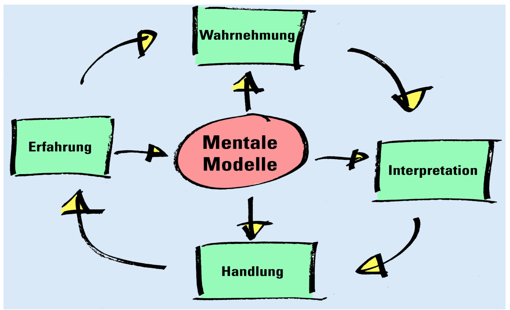

# Wahrnehmung und ihre Vernetzung

&lt;BILD POLIZIST und CO-Polizist&gt;  
=&gt; Meistens wird Räuber + Polizist interpretiert, aber in Wirklichkeit sind es ein uniformierten und ein ziviler Polizist die einen Ladendieb hinterher rennen.

Wahrnehmen

* Selektive Wahrnehmung \(Auto auf der Strasse, Kinderwagen\)
* Immer sehr Subjektiv, wir können uns für die Objektivität bemühen \(aber wir müssen uns bewusst sein das wir immer Subjektiv sind\)
* Angeboren, dass wir immer Interpretieren

Interpretation

* ist wie die Wahrnehmung auch Subjektiv
* Zentral = Interpretation überprüfen
* 

